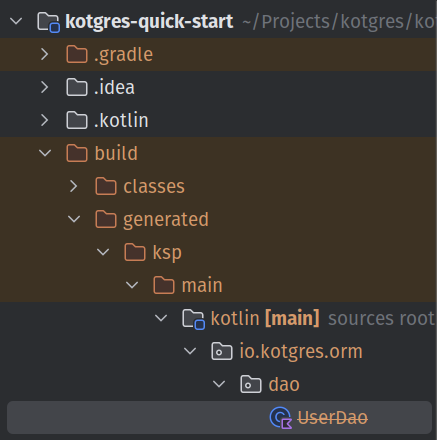

**This library is in alpha, and the API is subject to change**

This is a blazing-fast Kotlin ORM to access your Postgres database _(also works with Java)_.

It stands out because it is:

✅ **Blazing fast**: trading blows with ORMLite as the fastest Kotlin/Java ORM for Postgres (according to our benchmarks)

✅ **Simple & low-api surface**: only one way to do things to avoid confusion

✅ **Postgres-only**: to keep things simple and maximize performance (no other databases will ever be integrated)

✅ **Extensible**: you can accommodate any use cases by adding new operators, using raw queries, ...

✅ **No-config**: no more XML or YAML files, only minimal annotations on your entities

✅ **Clean architecture friendly**: does not leak into your domain or presentation layers


## Installation

### Add Kotlin KSP

Kotlin Symbol Processing is used to generate code based on the annotations you create.

To add it to your project add this to your plugins section:
```kotlin
plugins {
    <...>
    id("com.google.devtools.ksp") version "1.9.25-1.0.20"
}
```


Or if you use Groovy (aka `build.gradle`):
```groovy
plugins {
    <...>
    id 'com.google.devtools.ksp' version '1.9.25-1.0.20'
}
```


### Add the dependency

The library is currently distributed through Jitpack, planning to release on Maven Central soon. To install, add this to your `build.gradle.kts`:

```kotlin
repositories {
    <...>
    maven { setUrl("https://jitpack.io") }
}

dependencies {
    <...>
    implementation("com.github.kotgres:kotgres-dsl:v0.1.1")
    ksp("com.github.kotgres:kotgres:v0.1.4")
    implementation("com.github.kotgres:kotgres:v0.1.4")
}
```

Or if you use Groovy (aka `build.gradle`):
```groovy
repositories {
    <...>
    maven { url 'https://jitpack.io' }
}

dependencies {
    <...>
    implementation 'com.github.kotgres:kotgres-dsl:v0.1.2'
    ksp 'com.github.kotgres:kotgres:v0.1.4'
    implementation 'com.github.kotgres:kotgres:v0.1.4'
}
```

### Add the noarg plugin

Add the [noarg compiler plugin](https://kotlinlang.org/docs/no-arg-plugin.html) to automatically generate no-argument constructor for your entities (Kotgres needs those):
```kotlin
plugins {
    <...>
    kotlin("plugin.noarg") version "2.1.0"
}
```

And configure it by adding this anywhere in your `build.gradle` or `build.gradle.kts`:
```kotlin
noArg {
    annotation("io.kotgres.orm.annotations.Table")
}
```

## Quick start

_If you just want a working example go to the [example repo](https://github.com/kotgres/kotgres-quick-start)_

1. Make sure you have followed the Installation section instructions above.

2. Create a new Kotlin file called `User.kt` and paste this code:

```kotlin
import io.kotgres.orm.annotations.Generated
import io.kotgres.orm.annotations.PrimaryKey
import io.kotgres.orm.annotations.Table
import java.time.LocalDateTime

@Table(name = "users")
data class User(
    @PrimaryKey
    @Generated
    val id: Int,
    val name: String,
    val email: String,
    val age: Int,
    val description: String?,
    val createdAt: LocalDateTime,
    val updatedAt: LocalDateTime,
)
```

As you can see, we are creating a new `User` entity and defining how it looks on the database so the ORM can map it correctly.

This would be an equivalent SQL file:

```sql
CREATE TABLE IF NOT EXISTS users
(
    id          int GENERATED BY DEFAULT AS IDENTITY PRIMARY KEY,
    name        TEXT NOT NULL,
    email       TEXT NOT NULL,
    age         INT  NOT NULL,
    description TEXT,
    created_at  TIMESTAMP DEFAULT now(),
    updated_at  TIMESTAMP DEFAULT now()
);
```

3. Run a Gradle `build` (you can do that in IntellIJ > Right Panel > Tasks > build > build)

After it finishes you should see the generated file inside your project generated files: `build/generated/ksp/main/kotlin/<your_package>/dao/UserDao`



4. Now let's create a new file `Main.kt` and let's add:

First the database connection code:
```kotlin
import io.kotgres.orm.connection.KotgresConnectionPool
import io.kotgres.orm.connection.KotgresConnectionPoolConfig

val connectionPool = KotgresConnectionPool.build(
    KotgresConnectionPoolConfig(
        "0.0.0.0", // host
        "kotgres", // database name
        54333, // port
        "kotgres", // username
        "kotgres", // password
    ),
)
```

And a sample main to test that it works:

```kotlin
import io.kotgres.orm.dao.PrimaryKeyDao
import io.kotgres.orm.manager.DaoManager
import java.time.LocalDateTime

<...>

fun main() {
    connectionPool.runQueryVoid(
        """
            CREATE TABLE IF NOT EXISTS users
            (
                id          int GENERATED BY DEFAULT AS IDENTITY PRIMARY KEY,
                name        TEXT NOT NULL,
                email       TEXT NOT NULL,
                age         INT  NOT NULL,
                description TEXT,
                created_at  TIMESTAMP DEFAULT now(),
                updated_at  TIMESTAMP DEFAULT now()
            );
        """.trimIndent()
    )

    val userDao: PrimaryKeyDao<User, Int> = DaoManager.getPrimaryKeyDao(connectionPool)

    val insertedUser =
        userDao.insert(User(-1, "kotgres", "kotgres@kotgres.io", 42, null, LocalDateTime.now(), LocalDateTime.now()))
    println("New user has id ${insertedUser.id}")

    val allUsers = userDao.getAll()

    println("There are ${allUsers.size} users in the database")
}
```

5. Before running the code, you will need a database engine running on `localhost:54333`, with the username, password and database name: `kotgres`

You can quickly bring one up, using docker. You can install it [here](https://docs.docker.com/desktop/).

Once you have it, you can paste this code in a `docker-compose.yml` file:
```yaml
services:
  db:
    image: postgres:15.1-alpine
    container_name: "kotgres-example-quick-start"
    environment:
      - POSTGRES_USER=kotgres
      - POSTGRES_PASSWORD=kotgres
      - POSTGRES_DB=kotgres
    ports:
      - '54333:5432'
```

And just run `docker compose up -d`

6. If you now run your `main` function in `Main.kt` you should get a result like this in console:

```
New user has id 1
There are 1 users in the database
```

7. Congratulations 🎉 You have successfully created a Kotlin application that uses Kotgres to connect to a PostgreSQL database!

Feel free to play around with `userDao` to learn more about what you can do! Here is a list of some methods you can try:
- `userDao.update`: to update entities
- `userDao.delete`: to delete entities by passing the entity
- `userDao.deleteById`: to delete entities by passing the id
- `userDao.getByPrimaryKey`: to get an entity by its primary key
- `userDao.runSelect` && `userDao.selectQuery`: to run complex select queries returning an entity
